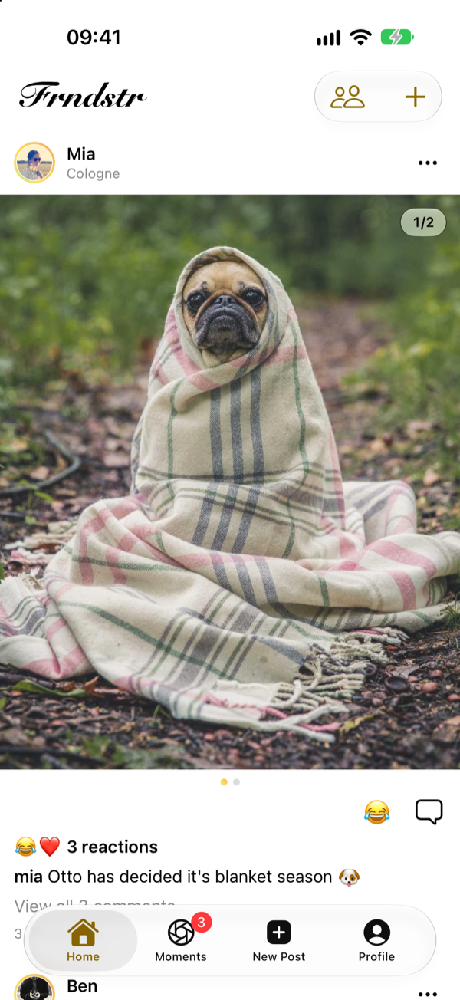
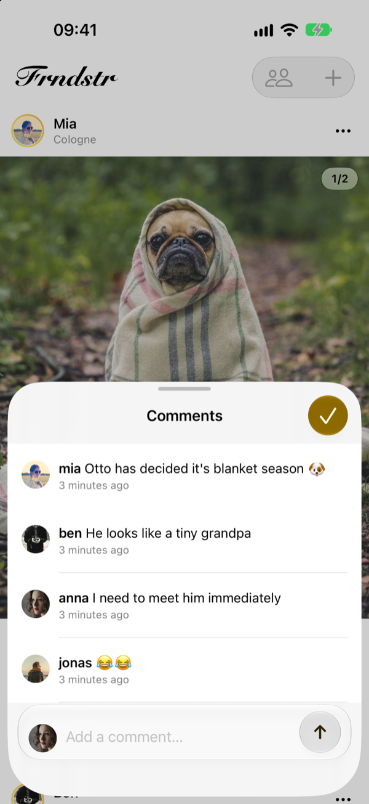
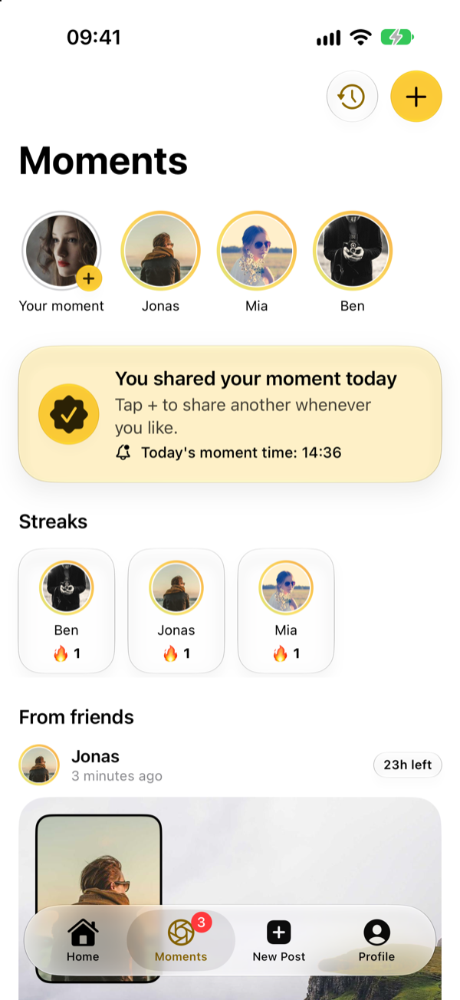
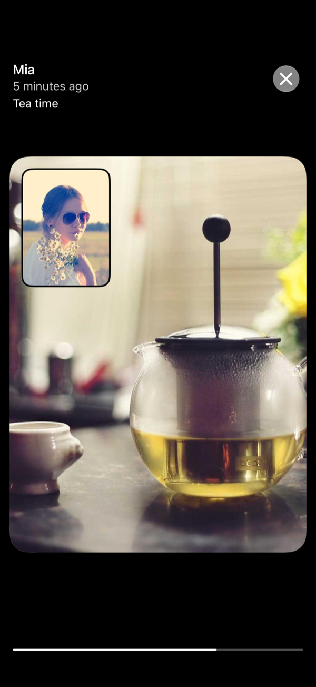
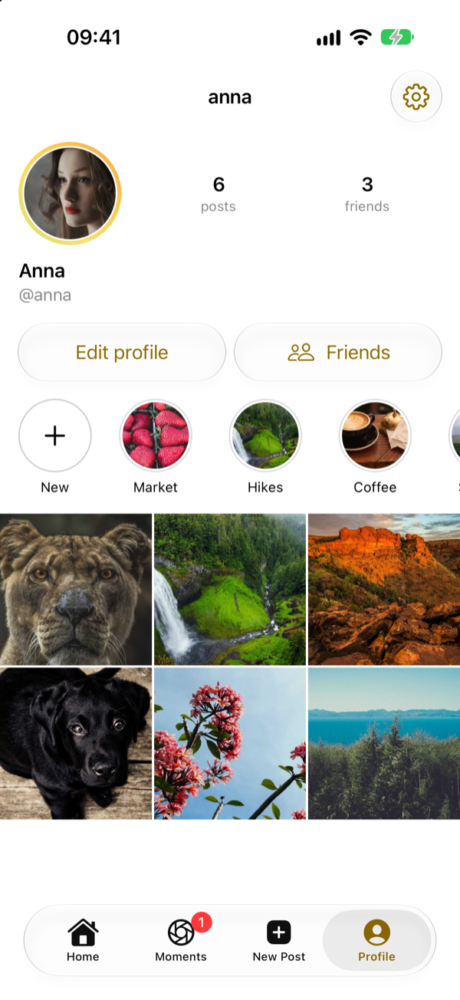

# Frndstr

> [!WARNING]
> This project is vibe coded and unaudited, so host it behind [Tailscale](https://tailscale.com) or [Cloudflare Access](https://www.cloudflare.com/zero-trust/products/access/) and never expose the server directly to the internet.

A private, self-hosted family Instagram with BeReal-style **Moments**: an iOS app plus a small server
you run yourself with one `docker compose up`.

<p align="center">
  
  
  
  
  
</p>
<p align="center"><sub>Demo data; photos from <a href="https://unsplash.com">Unsplash</a> via <a href="https://picsum.photos">Lorem Picsum</a>.</sub></p>

## What it does

- **Posts**: photos and videos (carousel), captions (editable), reactions, comments, a newest-first
  feed, profiles. Everyone on your server sees everyone's posts.
- **Moments**: front + back camera at the same time, sent to the friends you pick and gone after 24
  hours. Today's moments from friends stay locked until you've shared your own. Friendship streaks,
  a shared daily "moment time", a stories row, pinch to resize the small photo.
- **Memories**: your own moments stay on *your* iPhone as a calendar you can play back.
- **Highlights**: pick moments for your profile; your friends see them once each moment's 24 hours are over.
- **Save to Photos** with caption, place and date written into the file (you're asked first).
- **Takeout**: one zip with all your posts, highlights and moments.
- **Admin dashboard** in the browser: first-run setup, people, invite codes, storage, settings.
- **Private by design**: invite-only, no analytics, no third-party services. The app only talks to
  the server address you type in.

## Repository layout

| Path | What |
|---|---|
| `docker-compose.yml` | Run the server from the prebuilt image (see below). |
| `server/` | Swift (Vapor) + SQLite + ffmpeg server, Dockerfile, compose file. See [server/README.md](server/README.md). |
| `Shared/FrndstrAPI/` | Dependency-free Swift package with the API types shared by app and server. |
| `Frndstr/`, `Frndstr.xcodeproj` | The iOS app (SwiftUI, iOS 26+). |
| `docs/` | [PLAN.md](docs/PLAN.md) (design + milestones) and [JOURNAL.md](docs/JOURNAL.md) (dev log). |

## Run the server

On any machine with Docker (a NAS, a Raspberry Pi 5, an old laptop). You don't need to clone this repo.
The prebuilt image (`ghcr.io/kurma99/frndstr-server`, amd64 + arm64) comes from GitHub Actions.

**1. Get the compose file**

```sh
mkdir frndstr && cd frndstr
curl -O https://raw.githubusercontent.com/kurma99/FRNDSTR/main/docker-compose.yml
```

Or create `docker-compose.yml` yourself:

```yaml
services:
  frndstr:
    image: ghcr.io/kurma99/frndstr-server:latest
    restart: unless-stopped
    environment:
      DATA_DIR: /data
      INSTANCE_NAME: Frndstr        # shown in the app when connecting
      TIME_ZONE: Europe/Berlin      # defines "today" for moments
      LOG_LEVEL: info
    ports:
      - "8080:8080"                 # change the left side for another host port
    volumes:
      - ./data:/data                # database + all media: back this up
```

**2. Start it**

```sh
mkdir -p data && sudo chown 1001:1001 data   # Linux: the server runs as uid 1001 (skip on Docker Desktop)
docker compose up -d
```

**3. Set it up**

1. Open `http://<server>:8080/` in a browser and create the admin account (first start only).
2. Make it reachable for your family privately:
   - **Tailscale:** put the machine on your tailnet. For HTTPS without certificates: `tailscale serve --bg 8080`.
   - **Cloudflare:** run a [Cloudflare Tunnel](https://developers.cloudflare.com/cloudflare-one/connections/connect-networks/)
     to `http://localhost:8080`, protect it with Access, and create a service token for the app.
3. In the dashboard, create invite codes for your family.
4. Back up the `data/` folder (SQLite database + all media). That's everything.

**Update:** `docker compose pull && docker compose up -d`. **Logs:** `docker compose logs -f`.

To build the image from source instead, clone the repo and use `server/docker-compose.yml`
(`cd server && docker compose up -d --build`). See [server/README.md](server/README.md).

## Run the app

The app isn't on the App Store. Open `Frndstr.xcodeproj` in Xcode, set **your own** team and bundle
identifier under *Signing & Capabilities*, and run it on your iPhone (or ship it to your family through
TestFlight). On first launch, enter your server's address (e.g. `https://box.tailnet.ts.net` or
`http://100.x.y.z:8080`, or your Cloudflare tunnel address plus service token) and an invite code.

Plain HTTP is allowed on purpose (`NSAllowsArbitraryLoads`), so Tailscale IPs work without certificates.
Traffic inside a tailnet is encrypted anyway.

## Development

```sh
cd server && swift test                 # needs ffmpeg (brew install ffmpeg)
cd Shared/FrndstrAPI && swift test
```

The app's tests run in Xcode (⌘U). CI runs the server and API tests on Linux for every push, and
publishes the Docker image from `main` and from `v*` tags (see `.github/workflows/`).

## License

[MIT](LICENSE): do what you like, no warranty.
